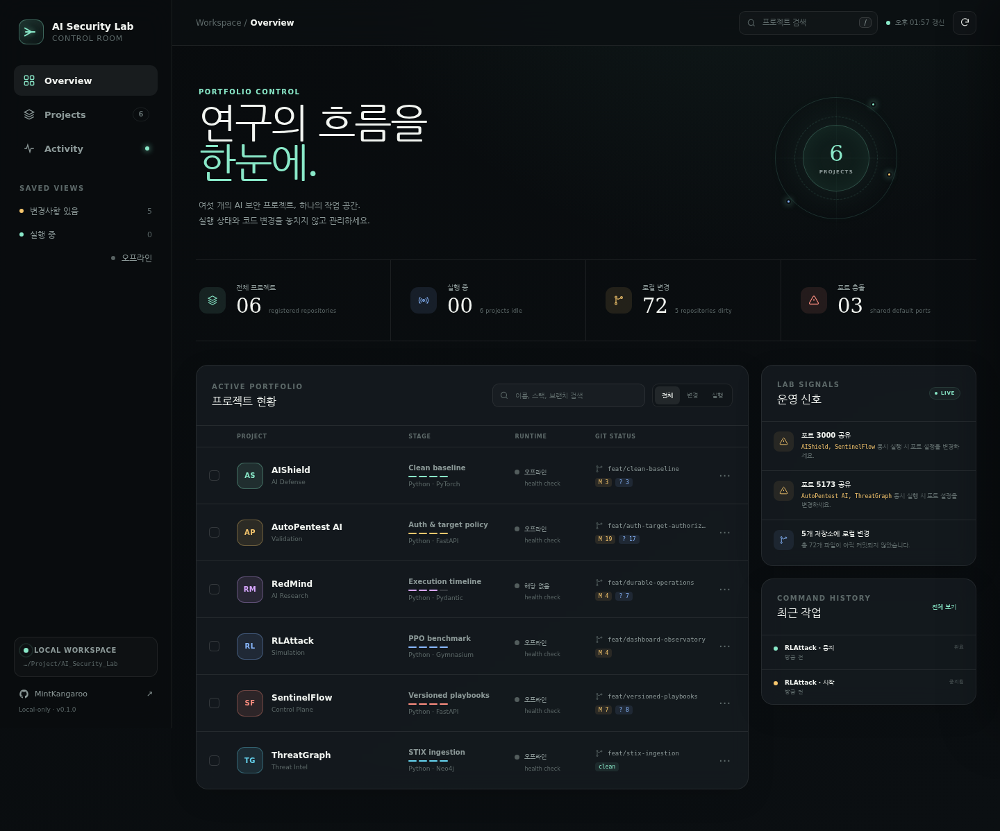
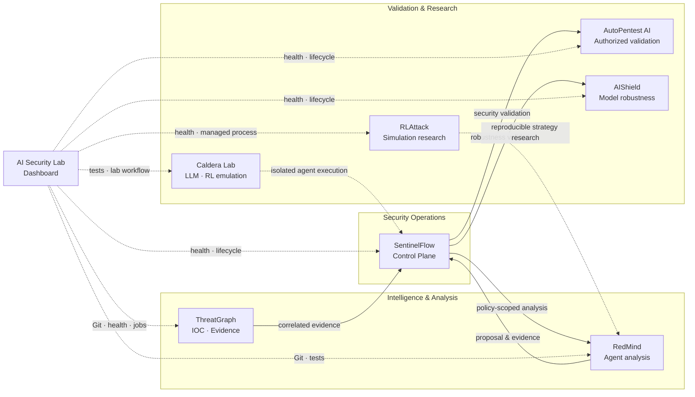
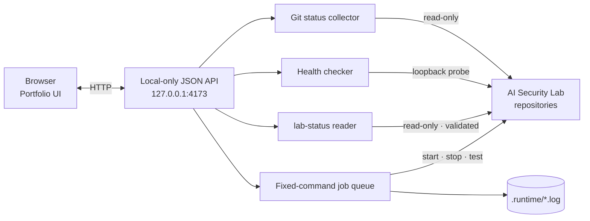

# AI Security Lab Dashboard

`AI_Security_Lab` 아래의 연구 프로젝트를 한 화면에서 점검하고 관리하는 로컬 Control
Room입니다. AIShield, AutoPentest AI, RedMind, RLAttack, SentinelFlow, ThreatGraph,
Caldera Lab의
Git 작업 상태와 서비스 상태를 자동으로 수집합니다.


<p align="center">
  <a href="docs/assets/dashboard-overview.png">
    
  </a>
</p>

## 포트폴리오 한눈에 보기

| 프로젝트 | 핵심 역할 | 현재 단계 | 기본 화면 |
| --- | --- | --- | --- |
| [AIShield](https://github.com/MintKangaroo/AIShield) | AI 모델 적대적 강건성 평가 | Clean baseline | `:3000` |
| [AutoPentest AI](https://github.com/MintKangaroo/AutoPentest-AI) | 허가 기반 보안 검증 | Auth & target policy | `:5173` |
| [RedMind](https://github.com/MintKangaroo/RedMind) | 정책 통제형 Multi-Agent 분석 | Execution timeline | Library/API |
| [RLAttack](https://github.com/MintKangaroo/RLattack) | 재현 가능한 공격 경로 시뮬레이션 | PPO benchmark | `:8501` |
| [SentinelFlow](https://github.com/MintKangaroo/SentinelFlow) | 탐지·승인·대응·검증 Control Plane | Versioned playbooks | `:3000` |
| [ThreatGraph](https://github.com/MintKangaroo/ThreatGraph) | IOC·Evidence 기반 위협 그래프 | STIX ingestion | `:5173` |
| [Caldera Lab](https://github.com/MintKangaroo/Caldera-Lab) | 격리형 LLM/RL 에이전트 실행 연구 | Isolated AI/RL planner | CLI · Docker |



## 제공 기능

- 7개 프로젝트의 현재 브랜치, 수정/미추적 파일, upstream 차이, 최근 커밋 수집
- 등록된 health endpoint의 온라인, 오프라인, 다른 서비스 점유 상태 확인
- 서비스가 없는 프로젝트가 게시한 `lab-status/1` 상태 문서 수집과 표시
- 프로젝트명, 스택, 브랜치 검색과 변경/실행 상태 필터
- 기본 포트를 공유하는 프로젝트의 동시 실행 충돌 경고
- 프로젝트별 또는 선택 프로젝트 일괄 시작, 중지, 테스트
- 프로젝트별 중복 명령 차단과 Dashboard-managed 장시간 서비스 중지
- 브라우저를 막지 않는 비동기 명령 실행과 실시간 작업 로그
- 모바일 화면을 포함한 반응형 로컬 대시보드
- 외부 런타임 패키지 없이 Python 표준 라이브러리만으로 실행

## 현재 완성도

대시보드 저장소의 핵심 범위는 완료되어 `main` 브랜치에 반영되어 있습니다.

| 영역 | 상태 | 확인 내용 |
| --- | --- | --- |
| 7개 프로젝트 통합 | 완료 | Git·health·포트·실행 명령을 단일 설정으로 관리 |
| 작업 제어 | 완료 | 비동기 시작·중지·테스트, 중복 실행 차단, 관리형 서비스 종료 |
| 작업 이력 | 완료 | `.runtime/jobs.json`에 저장하고 재시작 중 작업은 `interrupted`로 표시 |
| 시각화 | 완료 | 반응형 대시보드, 프로젝트 검색/필터, Mermaid 구조도, README 스크린샷 |
| 랩 telemetry | 완료 | 프로젝트가 게시한 `lab-status/1` 문서를 검증 후 카드·상세에 표시 |
| 품질 검증 | 완료 | Python 3.10/3.12 GitHub Actions, 28개 테스트, Ruff, 브라우저 JS 검사 |

현재 남은 것은 배포 환경에 따른 운영 설정뿐입니다. 각 하위 프로젝트의 Docker 이미지,
`.env` 값, 데이터베이스/Neo4j 같은 의존성은 해당 프로젝트에서 준비해야 하며, 이 대시보드는
개인 개발 머신의 `127.0.0.1`에 바인딩됩니다. 외부 공유가 필요하면 인증·TLS를 제공하는
Reverse Proxy를 추가하세요.

## 빠른 시작

대시보드 저장소가 다음처럼 다른 프로젝트와 같은 상위 디렉터리에 있으면 별도 설정 없이
자동으로 찾습니다.

```text
AI_Security_Lab/
├── aishield/
├── autopentest-ai/
├── redmind/
├── rlattack/
├── sentinelflow/
├── threatgraph/
└── ai-security-lab-dashboard/
```

```bash
cd AI_Security_Lab/ai-security-lab-dashboard
python3 -m pip install -e .
lab-dashboard
```

브라우저에서 <http://127.0.0.1:4173>을 엽니다.

개발 검사를 함께 설치하려면 다음 명령을 사용합니다.

```bash
python3 -m pip install -e ".[dev]"
make check
```

설치하지 않고 실행할 수도 있습니다.

```bash
PYTHONPATH=src python3 -m lab_dashboard
```

## 화면에서 실행되는 작업

프로젝트 카드의 상세 패널 또는 하단 일괄 작업 바에서 실행합니다.

| 작업 | 동작 |
| --- | --- |
| 시작 | 설정에 등록된 `docker compose up -d --build` 등의 명령 실행 |
| 중지 | `docker compose down` 실행, 볼륨은 삭제하지 않음 |
| 테스트 | 각 저장소의 `make test` 실행 |

명령은 Shell 문자열이 아니라 고정된 인자 배열로 실행됩니다. 브라우저가 임의 명령이나
프로젝트 경로를 전달할 수 없고, 실행 결과는 `.runtime/` 아래의 Git에서 제외된 로그로
저장됩니다.

RLAttack처럼 포그라운드에서 계속 실행되는 서비스는 Dashboard-managed process로
등록됩니다. 중지 작업은 해당 프로세스 그룹을 안전하게 종료하며, 대시보드를 종료할 때도
남은 관리형 프로세스를 정리합니다.

> AIShield, AutoPentest AI, SentinelFlow, ThreatGraph는 기본 API 포트 `8000`을
> 공유합니다. 여러 스택을 동시에 시작하기 전에 각 프로젝트의 `.env`에서 포트를
> 분리하세요. 대시보드의 포트 충돌 신호가 이 상태를 표시합니다.

## 프로젝트 설정

기본 설정은
[`src/lab_dashboard/config/projects.json`](src/lab_dashboard/config/projects.json)에
있습니다. 프로젝트는 `AI_Security_Lab`의 직계 하위 디렉터리만 허용됩니다.

```json
{
  "id": "example",
  "name": "Example",
  "path": "example",
  "github": "https://github.com/MintKangaroo/Example",
  "ports": [8080],
  "health_url": "http://127.0.0.1:8080/health",
  "health_contains": "example",
  "status_file": ".runtime/status.json",
  "actions": {
    "start": ["docker", "compose", "up", "-d"],
    "stop": ["docker", "compose", "down"],
    "test": ["make", "test"]
  }
}
```

### 랩 telemetry (`status_file`)

health endpoint가 없는 프로젝트도 자기 작업 결과를 게시할 수 있습니다. `status_file`에
프로젝트 안의 상대 경로를 지정하면 대시보드가 그 파일을 읽어 카드와 상세 패널에
표시합니다. 현재 Caldera Lab이 `caldera-lab run` 이후 `.runtime/status.json`을 씁니다.

```json
{
  "schema": "lab-status/1",
  "generated_at": "2026-09-05T10:56:59Z",
  "state": "ok",
  "headline": "8/8 techniques covered",
  "metrics": [{ "label": "ATT&CK coverage", "value": "8/8" }]
}
```

대시보드는 이 숫자들이 무엇을 뜻하는지 알지 못합니다. label/value 쌍을 그대로 그릴 뿐이며,
도메인 해석은 파일을 쓰는 프로젝트가 책임집니다. 파일은 대시보드가 아니라 프로젝트가
쓰므로 신뢰하지 않는 입력으로 다룹니다: 스키마가 다르면 거부하고, 프로젝트 밖을 가리키는
경로와 심볼릭 링크는 거부하며, 지표 개수와 문자열 길이를 잘라냅니다. 모르는 `state`는
`unknown`으로 내려앉습니다.

다른 Lab 경로를 사용하려면 환경 변수로 덮어쓸 수 있습니다.

```bash
AI_SECURITY_LAB_ROOT=/absolute/path/to/AI_Security_Lab lab-dashboard
```

다른 설정 파일은 `--config`로 선택합니다.

```bash
lab-dashboard --config ./my-projects.json
```

## 안전 경계

- 기본 바인딩은 `127.0.0.1`이며 네트워크 외부에 공개하지 않습니다.
- 상태 변경 요청에는 대시보드 전용 헤더와 로컬 Origin 검사가 적용됩니다.
- 프로젝트 경로는 Lab 루트의 직계 하위 경로로 제한됩니다.
- `stop`은 볼륨 삭제 옵션을 사용하지 않습니다.
- 명령은 프로젝트 설정에 등록된 `start`, `stop`, `test`만 허용합니다.
- Git 조회와 health check는 읽기 전용입니다.
- `status_file`은 프로젝트 디렉터리 안으로 제한되고, 스키마·크기·길이를 검증한 뒤에만
  화면에 올라갑니다. 프로젝트가 쓰는 파일이므로 신뢰하지 않는 입력으로 취급합니다.

공유 서버에서 사용하려면 인증과 TLS를 제공하는 별도 Reverse Proxy를 먼저 구성해야
합니다. 이 프로젝트는 개인 개발 워크스테이션의 로컬 운영 화면을 목표로 합니다.

## 구조



## 품질 검사

```bash
make check
node --check src/lab_dashboard/static/app.js
```

테스트는 경로 탈출 차단, Git 상태 수집, 포트폴리오 집계, 로컬 API 보호, 중복 작업 차단,
관리형 서비스의 실제 시작·중지, 그리고 랩 telemetry의 스키마·경로·심볼릭 링크·크기 거부를
검증합니다. GitHub Actions는 Python 3.10과 3.12에서
동일한 검사를 실행합니다.

## 라이선스

[MIT License](LICENSE)
